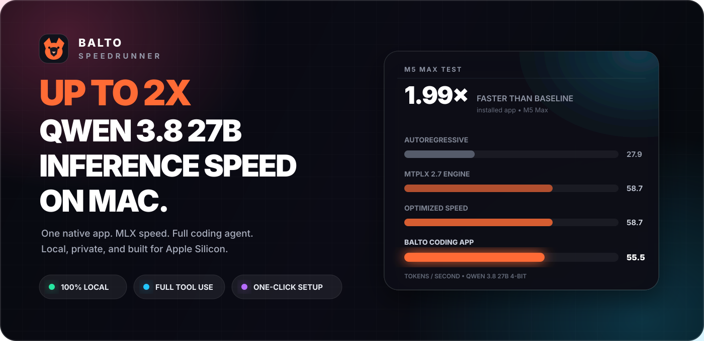

<p align="center">
  
</p>

<p align="center">
  <a href="https://github.com/jtc268/balto-speedrunner-mac/releases/download/v0.1.0-beta.2/Balto-Speedrunner-0.1.0-beta.2-arm64.dmg"></a>
</p>

<p align="center"><strong>macOS 14 or newer | Apple Silicon | 32 GB unified memory minimum</strong></p>

Balto Speedrunner installs the Qwen 3.8 27B Optimized Speed model, MTPLX 2.7, and a local coding harness. No terminal setup, Docker, account, or subscription is required.

## Install

1. Click **Download Balto for Mac** above.
2. Open the DMG.
3. Double-click Balto. It installs into Applications, opens, and ejects the installer disk.
4. Leave Balto open while it downloads the model and completes setup.

The beta is signed with Adore LLC's Apple Developer ID. Apple notarization is still pending, so macOS may require Control-click, then **Open**, on the first launch.

## What is included

| | Feature |
|---|---|
| ✅ | Qwen 3.8 27B text and vision |
| ✅ | Native MLX and MTPLX inference |
| ✅ | Terminal and workspace file tools |
| ✅ | Web search and page fetching |
| ✅ | Mac computer control tools |
| ✅ | Image paste, drag, and file attachment |
| ✅ | Live tokens-per-second meter |
| ✅ | Automatic compaction and long-job continuation |
| ✅ | Embedded desktop app with no browser window |
| ✅ | Model and download cache preserved across updates |
| ✅ | Closing the app stops every Balto process |

## Speed

Balto uses MTPLX 2.7 Optimized Speed, the recommended coding build. MTPLX's M5 Max release tests reached 58.7 tok/s on its coding instrument and 55.5 tok/s through the installed app. Bare Speed reached 64.4 tok/s in the installed app and 73 tok/s peak, but gives up coding quality. Prompt length, vision input, context size, memory bandwidth, and thermal state affect results.

| Mac | Memory | Context | Expected decode speed |
|---|---:|---:|---:|
| M5 Max | 128 GB | 262K | About 55 to 60 tok/s on MTPLX 2.7 Optimized Speed |
| M3/M4/M5 Max | 48 GB or more | 65K | Hardware dependent |
| M1/M2/M3/M4/M5 Pro or Max | 32 GB | 32K | Hardware dependent |

Intel Macs and Macs with less than 32 GB of unified memory are not supported.

## Test it

After setup, try these prompts:

1. `Count from 1 to 20, one number per line.`
2. `Run pwd in the terminal and tell me the current workspace.`
3. `Search the web for today's Apple developer news and cite the source.`
4. Attach an image from the `+` menu and ask Balto to describe it.

Quit the app when finished. The model, gateway, workspace, and owned helper processes should stop.

## Development

```bash
npm install
npm test
npm run dev
```

The optimized model weights and MTPLX runtime are downloaded during first launch and are not stored in this repository.

## Signing

Release builds support Apple Developer ID signing, notarization, stapling, and signed in-app updates. The current public beta is Developer ID signed and awaiting notarization.

## Credits

Balto is powered by [MTPLX](https://github.com/youssofal/MTPLX), uses [DeepSeek Harness](https://github.com/deepseek-ai/DeepSeek-Harness) as its coding workspace, and runs Qwen 3.8 27B locally. See [THIRD_PARTY_NOTICES.md](THIRD_PARTY_NOTICES.md).
